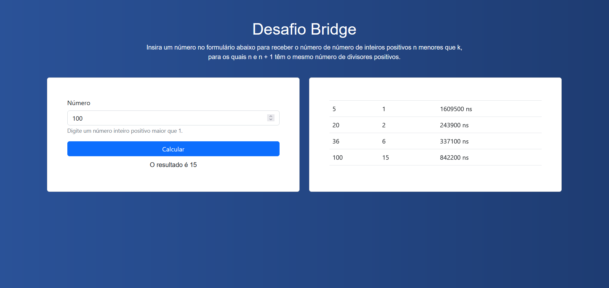

# Desafio Bridge

## Tecnologias utilizadas
### Backend
No backend foi utilizado Java com Springboot, iniciando com as seguintes dependências:
* Spring Web: aplicada na construção da API REST com Spring MVC;
* Spring Data JPA: responsável por trabalhar a persistência na API a partir de Spring Data e Hibernate;
* PostgreSQL Driver: para a conexão com a base de dados Postgre;
* Validation: empregada nas validações de entrada dos endpoints.

O teorema matemático utilizado na resolução do desafio pode ser encontrado [aqui](https://math.stackexchange.com/questions/1118616/find-how-many-positive-divisors-a-number-has-what-would-you-do.)!

### Frontend
O frontend foi implementado com base no framework React, para a estilização utilizei React Bootstrap e CSS nativo.

##  Como executar

### Configurando o banco de dados
1. Rodar postgres no localhost na porta 5432;
2. Criar um banco de dados "numberdb";
3. Criar um schema "numberschema";
4. Criar uma tabela "number" no schema criado;

ou

Rodar o seguinte script:
```
CREATE DATABASE numberdb;
CREATE SCHEMA numberschema;

USE DATABASE numberdb;

CREATE TABLE numberschema.number(
id SERIAL PRIMARY KEY,
k int not NULL,
  result int,
  time int
);
```

### Backend
1. Acessar a pasta raíz do projeto "number_challenge":
2. Realizar o maven install das dependências;
3. Realizar o build da aplicação na IDE de sua escolha.

### Frontend
1. Instalar requirements;
2. Acessar a pasta "frontend";
3. Utilizar o comando "npm start" no terminal;
4. Acessar na web http://localhost/3000.

## Aplicação Web

